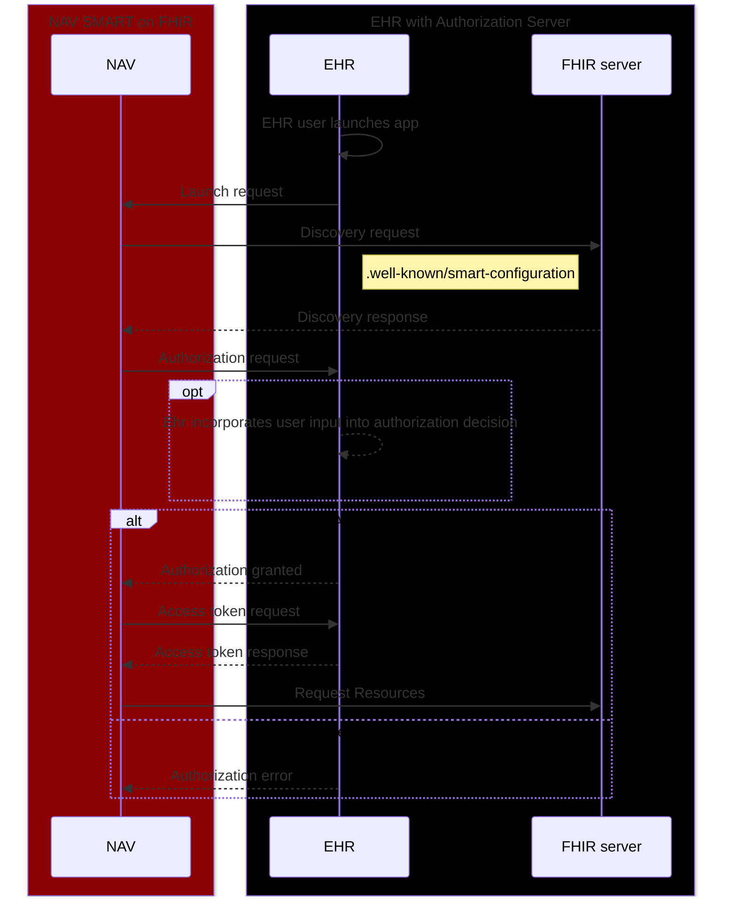

# Example SMART on FHIR application

***

#### <span style="color:red">!! THIS APPLICATION IS ONLY FOR TESTING AND MUST NOT BE USED IN PRODUCTION ENVIRONMENTS !!</span>

## Context

_SMART on FHIR example_ is used to verify that an EHR provider follows
the [SMART on FHIR standard](http://hl7.org/fhir/smart-app-launch/ImplementationGuide/hl7.fhir.uv.smart-app-launch)
according to NAVs requirements.

## Requirements

| Technology | Minimum version |
|------------|-----------------|
| Node       | 18              |
| Vite       | 5.3             |
| Typescript | 5.5             |
| React      | 18              |

### SMART on FHIR client library

In order to not reinvent the wheel, this application
uses [smarthealthit's client-js](https://docs.smarthealthit.org/client-js/client) for client initialization and FHIR
object mapping. The library follows SMART on FHIR best practices, but also provides flexibility in testing if needed. We
recommend that you spend some time reading the docs.

## Description

The application expects to be launched from within an integrated browser in an EHR application. The application expects
that the SMART-framework is implemented correctly, and that the FHIR data received by the FHIR API is formulated
according to Norwegian standard systems.

For example - HPR-number and Norwegian national identity number / D-number are required.

## Prerequisites

1. EHR **MUST** support [R4 FHIR profiles](https://hl7.org/fhir/R4/).
2. EHR provider **MUST** register `NAV_SMART_on_FHIR_example` as a valid client.
3. This application **SHOULD** be allowed to experiment with ALL available scopes SMART on FHIR has to offer. These can
   be set in the [.env](.env) file.
4. EHR **MUST** have an open `.well-known/smart-configuration` endpoint with the
   required [metadata](https://hl7.org/fhir/smart-app-launch/STU2.2/conformance.html#metadata).
5. EHR **MUST** initialize the application from the `/launch` endpoint for separation of concern with `launch_uri`
   and `redirect_uri`. This is
   a [recommended strategy](https://github.com/smart-on-fhir/client-js/blob/master/src/types.d.ts#L40-L59) by
   the `fhirclient` npm library and the SMART-framework in general.

## Start

```
$ pnpm run build
$ pnpm run dev
```

### Debug

Smarthealthit's `client-js` uses the [debug module](https://www.npmjs.com/package/debug), and this application
has the `DEBUG` env variable set by default.

In the browser, execute this in the console and then reload the page:

`localStorage.debug = "FHIR.*"`

## Local

If you wish to play around with the SMART startup you can clone this repository and edit the
[.env](.env) file to test different scopes and `client-id`s.

### SMART launcher

For basic testing and simulated error scenarios you can use the [SMART launcher](https://launch.smarthealthit.org/).
Ensure you fill in the following fields.

**App Launch Options**
> 1. Launch Type: Provider EHR Launch
> 2. FHIR Version: R4
> 3. App's Launch URL: http://localhost:5173/launch

**Client Registration & Validation**
> 1. Client Type: Public
> 2. Client Identity Validation: Strict
> 3. Client ID: NAV_SMART_on_FHIR_example
> 4. Allowed Scopes: openid profile fhirUser launch patient/\*.\* user/\*.\*
> 5. Allowed Redirect URIs: http://localhost:5173

## From EHR

Set the launch URL of this application to https://TODO.nav.no/launch and

## SMART launch sequence

1. Register app (client-id) with EHR (one-time step)
2. Launch the app with [EHR launch](https://hl7.org/fhir/smart-app-launch/STU2.2/app-launch.html#launch-app-ehr-launch)
3. Retrieve `.well-known/smart-configuration`
4. Obtain authorization code
5. Obtain access response
    1. Get proof of authentication (id_token)
    2. Get ability to retrieve information from the FHIR server (access_token)
    3. Get option to refresh access (refresh_token)
6. Fetch data from the FHIR API


