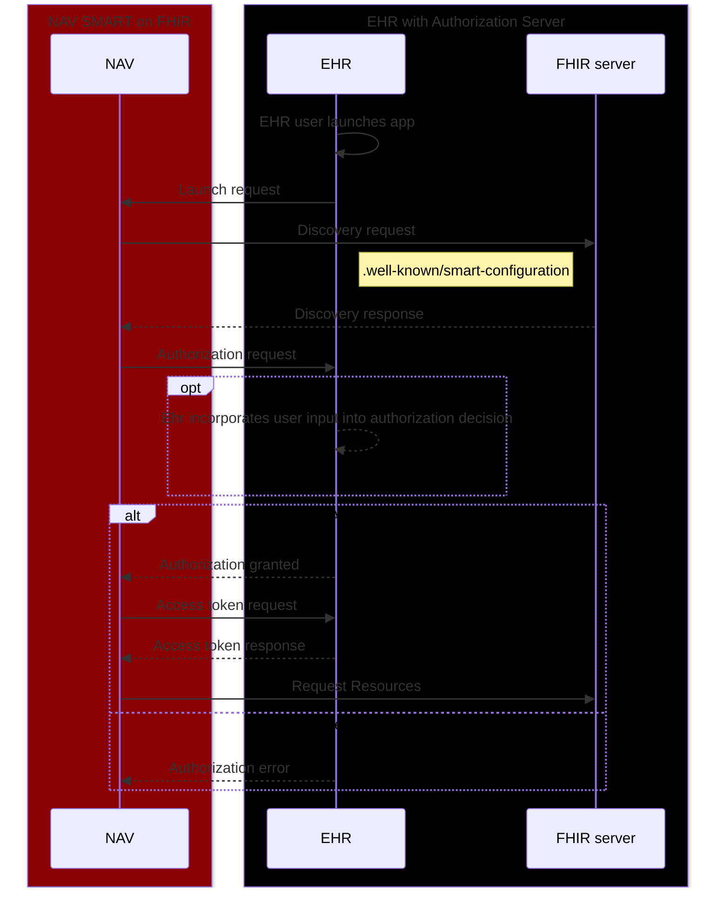

# Example SMART on FHIR application

$${\color{red}THIS \space APPLICATION \space IS \space ONLY \space FOR \space TESTING \space AND \space MUST \space NOT \space BE \space USED \space IN \space PRODUCTION \space ENVIRONMENTS}$$

## Context

_SMART on FHIR example_ is used to verify that an EHR provider follows
the [SMART on FHIR standard](http://hl7.org/fhir/smart-app-launch/ImplementationGuide/hl7.fhir.uv.smart-app-launch)
according to NAVs requirements.

## Requirements

| Technology | Minimum version |
|------------|-----------------|
| Node       | 20              |
| Vite       | 5.3             |
| Typescript | 5.5             |
| React      | 18              |

### SMART on FHIR client library

In order to not reinvent the wheel, this application
uses [smarthealthit's client-js](https://docs.smarthealthit.org/client-js/client) for client initialization and FHIR
object mapping. The library follows SMART on FHIR best practices, but also provides flexibility in testing if needed. We
recommend that you spend some time reading the docs.

## Description

The application expects to be launched from within an integrated browser in an EHR application. The application expects
that the SMART-framework is implemented correctly, and that the FHIR data received by the FHIR API is formulated
according to Norwegian standard systems.

For example - HPR-number and Norwegian national identity number / D-number are required.

## Validation expectations

### SMART on FHIR

#### [.well-known/smart-configuration](https://hl7.org/fhir/smart-app-launch/conformance.html#metadata)

```json
{
  "issuer": "CONDITIONAL, String conveying this system’s OpenID Connect Issuer URL. Required if the server’s capabilities include sso-openid-connect; otherwise, omitted.",
  "jwks_uri": "CONDITIONAL, String conveying this system’s JSON Web Key Set URL. Required if the server’s capabilities include sso-openid-connect; otherwise, optional.",
  "authorization_endpoint": "CONDITIONAL, URL to the OAuth2 authorization endpoint. Required if server supports the launch-ehr or launch-standalone capability; otherwise, optional.",
  "grant_types_supported": "REQUIRED, Array of grant types supported at the token endpoint. The options are “authorization_code” (when SMART App Launch is supported) and “client_credentials” (when SMART Backend Services is supported).",
  "token_endpoint": "REQUIRED, URL to the OAuth2 token endpoint.",
  "capabilities": "REQUIRED, Array of strings representing SMART capabilities (e.g., sso-openid-connect or launch-standalone) that the server supports.",
  "code_challenge_methods_supported": "REQUIRED, Array of PKCE code challenge methods supported. The S256 method SHALL be included in this list, and the plain method SHALL NOT be included in this list.",
  "user_access_brand_bundle": "RECOMMENDED, URL for a Brand Bundle-",
  "user_access_brand_identifier": "RECOMMENDED, Identifier for the primary entry in a Brand Bundle.",
  "scopes_supported": "RECOMMENDED, Array of scopes a client may request. The server SHALL support all scopes listed here; additional scopes MAY be supported (so clients should not consider this an exhaustive list).",
  "response_types_supported": "RECOMMENDED, Array of OAuth2 response_type values that are supported. Implementers can refer to response_types defined in OAuth 2.0 (RFC 6749) and in OIDC Core.",
  "management_endpoint": "RECOMMENDED, URL where an end-user can view which applications currently have access to data and can make adjustments to these access rights.",
  "introspection_endpoint": "RECOMMENDED, URL to a server’s introspection endpoint that can be used to validate a token.",
  "revocation_endpoint": "RECOMMENDED, URL to a server’s revoke endpoint that can be used to revoke a token."
}
```

#### [tokenResponse](https://build.fhir.org/ig/HL7/smart-app-launch/scopes-and-launch-context.html#launch-context-arrives-with-your-access_token)

```json
{
  "access_token": "abjfdksla...",
  "id_token": "abjfdksla...",
  "refresh_token": "abjfdksla...",
  "patient": "fhir-patient-id",
  "encounter": "fhir-encounter-id",
  ...
}
```

#### [id_token](https://build.fhir.org/ig/HL7/smart-app-launch/scopes-and-launch-context.html#scopes-for-requesting-identity-data)

```json
{
  "profile": "fhir-practitioner-id or Practitioner/fhir-practitioner-id",
  "fhirUser": "Practitioner/fhir-practitioner-id",
  ...
}
```

### FHIR data

This app only checks that the `system` is valid according to the Norwegian identifiers (OID) which is described [here](https://www.ehelse.no/teknisk-dokumentasjon/oid-identifikatorserier-i-helse-og-omsorgstjenesten#nasjonale-identifikatorserier-for-personer)

#### User

[HPR-nummer](https://simplifier.net/packages/hl7.fhir.no.basis/2.0.16-beta/files/356574)

```json
{
   "resourceType": "Practitioner",
   "id": "52919099-6a7a-442c-b0d5-2b02c0dd4b74",
   "identifier": [
      {
         "system": "2.16.578.1.12.4.1.4.4",
         "value": "A Norwegian HPR-number"
      }
   ],
   ...
}
```

#### Patient

[Fødselsnummer](https://simplifier.net/packages/hl7.fhir.no.basis/2.0.16-beta/files/356544) or [D-nummer](https://simplifier.net/packages/hl7.fhir.no.basis/2.0.16-beta/files/356572)

```json
{
   "resourceType": "Patient",
   "id": "80a75b5a-fd30-4f38-895d-d8098fe7206e",
   "identifier": [
      {
         "system": "2.16.578.1.12.4.1.4.1",
         "value": "A Norwegian national identifier number"
      },
      {
         "system": "2.16.578.1.12.4.1.4.2",
         "value": "A Norwegian D-number"
      }
   ],
   ...
}
```

## Prerequisites

1. EHR **MUST** support [R4 FHIR profiles](https://hl7.org/fhir/R4/).
2. EHR provider **MUST** register `NAV_SMART_on_FHIR_example` as a valid client.
3. This application **SHOULD** be allowed to experiment with ALL available scopes SMART on FHIR has to offer. These can
   be set in the [.env](.env) file.
4. EHR **MUST** have an open `.well-known/smart-configuration` endpoint with the
   required [metadata](https://hl7.org/fhir/smart-app-launch/STU2.2/conformance.html#metadata).
5. EHR **MUST** initialize the application from the `/launch` endpoint for separation of concern with `launch_uri`
   and `redirect_uri`. This is
   a [recommended strategy](https://github.com/smart-on-fhir/client-js/blob/master/src/types.d.ts#L40-L59) by
   the `fhirclient` npm library and the SMART-framework in general.

## Start

```
$ yarn run build
$ yarn run dev
```

### Debug

Smarthealthit's `client-js` uses the [debug module](https://www.npmjs.com/package/debug), and this application
has the `DEBUG` env variable set by default.

In the browser, execute this in the console and then reload the page:

`localStorage.debug = "FHIR.*"`

## Local

If you wish to play around with the SMART startup you can clone this repository and edit the
[.env](.env) file to test different scopes and `client-id`s.

### Using the SMART launcher

For basic testing and simulated error scenarios you can use the [SMART launcher](https://launch.smarthealthit.org/).
Ensure you fill in the following fields.

**App Launch Options**
> 1. Launch Type: Provider EHR Launch
> 2. FHIR Version: R4
> 3. App's Launch URL: http://localhost:5173/launch

**Client Registration & Validation**
> 1. Client Type: Public
> 2. Client Identity Validation: Strict
> 3. Client ID: NAV_SMART_on_FHIR_example
> 4. Allowed Scopes: openid profile fhirUser launch patient/\*.\* user/\*.\*
> 5. Allowed Redirect URIs: http://localhost:5173

## From EHR

If your EHR systems FHIR URL is not in the list of allowed [externalHosts](.nais/dev-gcp.json) you must request it to be
added.
Either create a PR on this repository, or contact
the [team responsible for maintaining it](https://github.com/orgs/navikt/teams/helseopplysninger).

Set the launch URL of this application to https://nav-on-fhir.ekstern.dev.nav.no/launch and ensure you've registered the
client-id.

## SMART launch sequence

1. Register app (client-id) with EHR (one-time step)
2. Launch the app using [EHR launch](https://hl7.org/fhir/smart-app-launch/STU2.2/app-launch.html#launch-app-ehr-launch)
3. Retrieve `.well-known/smart-configuration`
4. Obtain authorization code
5. Obtain access response
    1. Get proof of authentication (id_token)
    2. Get ability to retrieve information from the FHIR server (access_token)
    3. Get option to refresh access (refresh_token)
6. Fetch data from the FHIR API



## A note on SMART on FHIR scopes

The scopes used in SMART on FHIR follow a special syntax that allows granularity while following CRUDS operations
(CREATE, READ, UPDATE, DELETE, SEARCH). This application requests all patient and user scopes using the wildcard `*.*`.
This can be replaced with `{FHIR resource type}.[c|r|u|d|s]}?param1=value1&param2=value2`. Before implementing
specific scopes,
read ["Scopes for requesting FHIR data"](https://build.fhir.org/ig/HL7/smart-app-launch/scopes-and-launch-context.html#fhir-resource-scope-syntax)
and get to know the syntax before implementing.

Basic examples:

_READ access for the selected patient in the EHR system_

| SCOPE             | Results in    |
|-------------------|---------------|
| patient/Patient.r | OK            |
| patient/Patient.* | INVALID SCOPE |
| patient/*.r       | INVALID SCOPE |
| patient/*.*       | INVALID SCOPE |

Advanced examples:

_READ and UPDATE access to the selected patient and all its FHIR resources_

| SCOPE                    | Results in    |
|--------------------------|---------------|
| `patient/Patient.ru`     | OK            |
| `patient/Appointment.ru` | OK            |
| `patient/Observation.ru` | OK            |
| `patient/*.ru`           | OK            |
| `patient/Patient.*`      | INVALID SCOPE |
| `patient/Patient.cds`    | INVALID SCOPE |
| `patient/Observation.*`  | INVALID SCOPE |
| `patient/Appointment.*`  | INVALID SCOPE |

_READ access to observations, but only
want [fine grained access](https://build.fhir.org/ig/HL7/smart-app-launch/scopes-and-launch-context.html#finer-grained-resource-constraints-using-search-parameters)
to laboratory observations_

| SCOPE                                                                                                       | Results in                |
|-------------------------------------------------------------------------------------------------------------|---------------------------|
| `patient/Observation.r?category=http://terminology.hl7.org/CodeSystem/observation-category&#124;laboratory` | OK                        |
| `patient/Observation.r`                                                                                     | OK (but undesired result) |